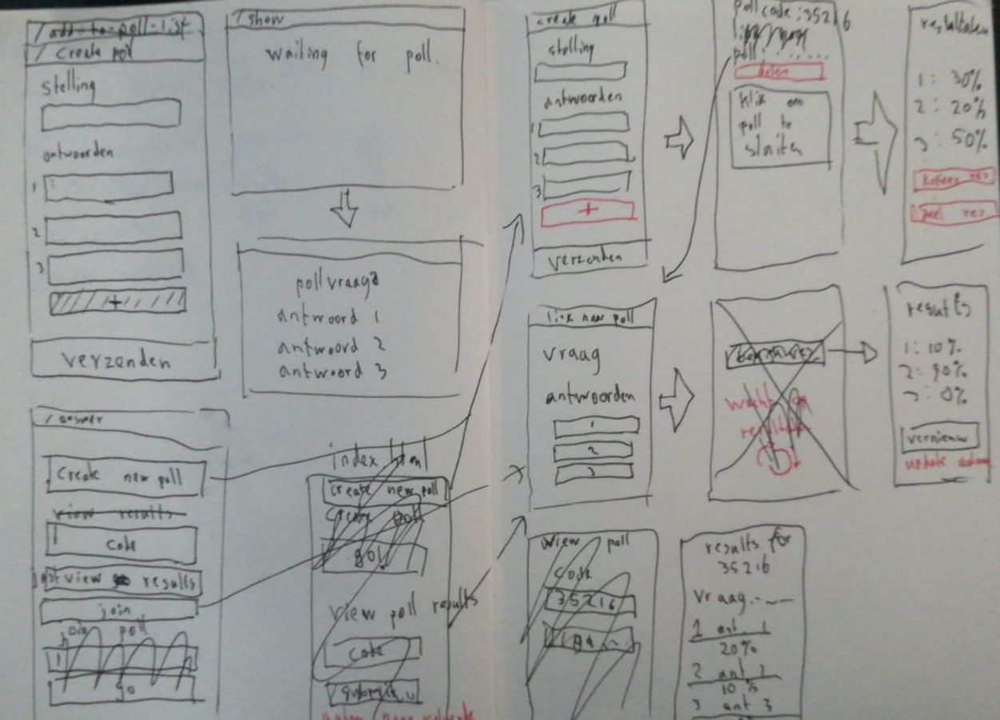

# Poll creator
This simple tool allows users to create polls and share those with other participants.

## Contents
- [Poll creator](#poll-creator)
  - [Contents](#contents)
  - [Core functionality](#core-functionality)
  - [Context](#context)
  - [Installation](#installation)
  - [Sketches](#sketches)
  - [Wireflow](#wireflow)
    - [Layers](#layers)
      - [functional](#functional)
      - [usable](#usable)
      - [pleasurable](#pleasurable)
  - [Code](#code)
    - [Server](#server)
    - [Client](#client)
    - [Dependencies](#dependencies)
      - [Dev Dependencies](#dev-dependencies)
  - [Features](#features)
  - [Progressive enhancement](#progressive-enhancement)
    - [JavaScript](#javascript)
  - [Feature detection](#feature-detection)

## Core functionality
Users must be able to create a new poll, by supplying a question or statement and some possible answers. Other people must be able to reach this poll and add an answer. The creator must then be able to close the poll and view and show the results.

## Context
The application will be used during classes where all participants are in the same room.

## Installation
To work on this project,
1. First clone this repository with `git clone https://github.com/lennartdeknikker/poll-creator.git`
2. Install the necessary dependencies with `npm install`
3. Use `npm run dev` to start nodemon and view changes in the browser.

## Sketches

## Wireflow
This wireflow shows the main structure for this application and what features will or could be introduced.
### Layers
#### functional
- this layer shows the elements that are necessary to deploy the core functionality.
#### usable
- This layer shows what functionality can be useful, but needs javascript to work.
#### pleasurable
- This layer shows in text what changes would make working with this application more pleasurable.

## Code
### Server
The server handles all the logic for this application. It creates polls, and saves the details and the amount of votes in a Mongo database collection. I defined several routes to handle requests for poll results, creating polls, closing polls and voting.
### Client
In order for this application to work, no JavaScript or CSS is necessary. Without that, users can still create and share polls. JavaScript on the client side is just used to enhance the user experience. The CSS makes it all look better, but is also redundant for the application's core functionalities.

### Dependencies
- cookie-parser 1.4.4
- debug 2.6.9
- dotenv 8.2.0
- ejs 2.6.1
- express 4.16.1
- mongoose 5.9.5
- morgan 1.9.1

#### Dev Dependencies
- eslint 6.8.0
- nodemon 2.0.2

## Features
- Create new polls
- Provide a link to share a poll
- vote on an answer
- Close polls
- View results

## Progressive enhancement
### JavaScript
To improve the user experience, I added a script that does the following things:
- it provides form validation before submitting a form. If JavaScript is turned off or doesn't work for any other reason, I created a fallback on the server. If a user does not complete a form before submitting, the user will land on a new page, telling the user what the problem is.
- it adds transitions between pages. These are not necessary, just provides a better user experience.
- When submitting a form, it adds a loader image, so the user is informed to wait for the server.
- It uses localstorage to provide the user with links to all the polls he has created and makes it possible to switch between those.

## Feature detection
Since localstorage is not supported in all browsers or may be blocked, I used feature detection to check if localstorage can be used before running that part of my code.